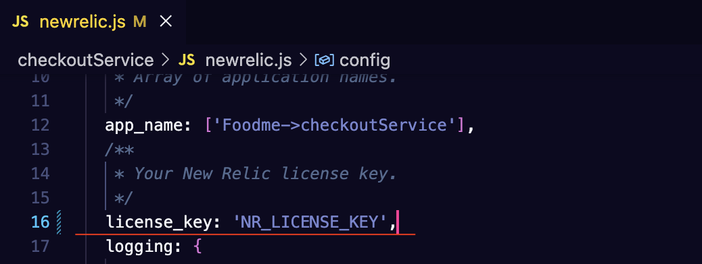
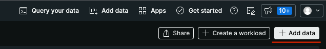
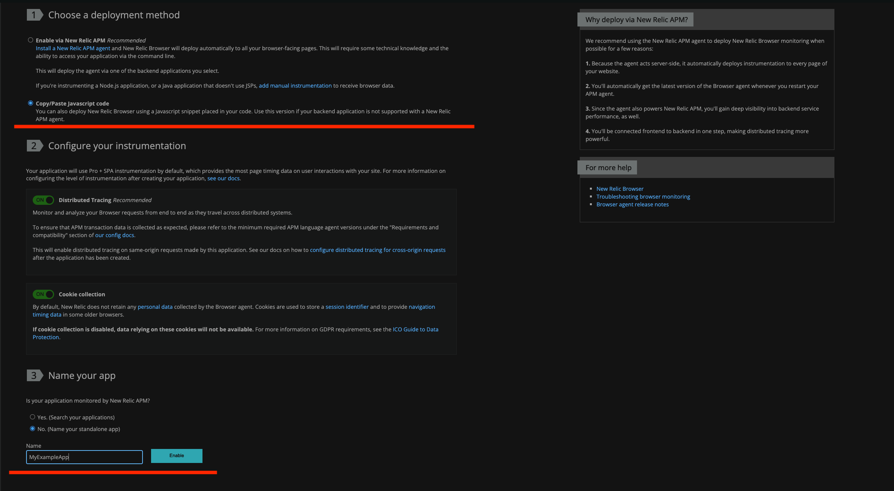
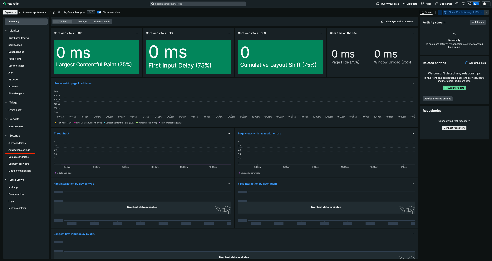
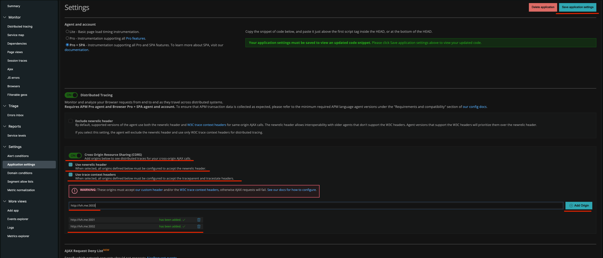

[](https://opensource.newrelic.com/oss-category/#new-relic-experimental)

# [Relicstaurants] [build badges go here when available]

> The Relicstaurants repository was created so that you can test New Relic observability on a small but real project. You don't have to create a special application just to practice, we did it for you. So go ahead and copy the repository, run it locally and try to implement observability for this project yourself. You can find a tip on what the finished project looks like on the "observability" branch

## Installation

```make
 make install
```

## Getting Started

```make
 make run
```

## Enabling distributed tracing

To enable distributed tracing for the backend parts of this application it is required to add your New Relic License key to the following files:

- [Checkout Service](checkoutService/newrelic.js#L16)
- [Menu Service](menuService/newrelic.js#L16)
- [Restaurant Service](restaurantService/newrelic.js#L16)

 Example:

 

 To enable distributed tracing for the frontend part it is required to go to [New Relic One](https://one.newrelic.com/) -> once there the user should click on the "Add data" button located on the top right of New Relic One as seen on the screenshot below:

 

Next the user should search for "react" in the search bar available there and click on the react icon visible in results. This should open a view called "Get started with New Relic Browser", in case of react apps it is recommended to select "Copy/Paste Javascript code" in the first section and then assign a name of the app in the third section as seen on the screenshot below:



After filling out the app name field and pressing "Enable", a fourth section called "Instrument the agent" will show up along with the instructions on how to add it. At this point in time it is recommended to close the popup window since there's still some things left to prepare. Next the user can proceed to the Browser section of New Relic One where they should see their newly created app available on the list.

Once the user clicks on their app in the list they would see a new view, on it is necessary to go the to the "Application settings" view in the "Settings" section on the left - like shown in the screenshot below:



In this view the user should enable "Cross Origin Resource Sharing(CORS)", "Use newrelic header", "Use trace context headers" and add the backend origins to enable newrelic headers to be passed between the frontend app and the backend ones. Next the user should click "Save application settings". Like on the screenshot below:



This will redirect the user to the main view of the browser app in New Relic One. At this point the user should re-enter the "Application settings" view and copy the snippet available in the first section of the view.
The snippet should be then pasted as close to the top of the [index.html](public/index.html#L6) file. After saving that change Distributed Tracing data should be available once the app is running.

## Contributing

We encourage your contributions to improve [project name]! Keep in mind when you submit your pull request, you'll need to sign the CLA via the click-through using CLA-Assistant. You only have to sign the CLA one time per project.
If you have any questions, or to execute our corporate CLA, required if your contribution is on behalf of a company, please drop us an email at opensource@newrelic.com.

### **A note about vulnerabilities**

As noted in our [security policy](../../security/policy), New Relic is committed to the privacy and security of our customers and their data. We believe that providing coordinated disclosure by security researchers and engaging with the security community are important means to achieve our security goals.

If you believe you have found a security vulnerability in this project or any of New Relic's products or websites, we welcome and greatly appreciate you reporting it to New Relic through [HackerOne](https://hackerone.com/newrelic).

## License

[Project Name] is licensed under the [Apache 2.0](http://apache.org/licenses/LICENSE-2.0.txt) License.

> [If applicable: The [project name] also uses source code from third-party libraries. You can find full details on which libraries are used and the terms under which they are licensed in the third-party notices document.]
